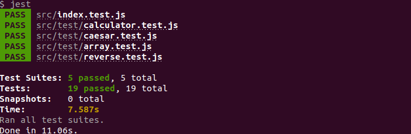

# JavaScriptTesting

> This project is focus on unit testing with JavaScript, the idea is to write tests for some functions, and then make them pass.

This app tests the following functions:
 - Capitalize(string) takes a string and returns that string with the first character capitalized.
 - ReverseString(string) takes a string and returns it reversed.
 - Calculator object that contains the basic operations: add, subtract, divide, and multiply.
 - Caesar Cipher. Read about it
 - Array Analysis. Write a function that takes an array of numbers and returns an object with the following properties: average, min, max, and length.

## Built With

- HTML5
- JavaScript
- Bootstrap
- Visual Code

### Prerequisites
npm 6.13.14

### Setup

To install all dependencies from a package.json file run:

 - $npm install

### Usage

To run the test go to the command line, and type one of the commands:

 - $yarn test 
  - $npm run test
  
  You will see the test result:

## Author

👤 **Gonza Javier Mancilla**

- Github: [@github/gonjavi](https://github.com/gonjavi)
- Linkedin: [linkedin](https://www.linkedin.com/in/g-javier-mancilla-a686a9178/)

## 🤝 Contributing

Contributions, issues and feature requests are welcome!

## Show your support

Give a ⭐️ if you like this project!

## 📝 License

This project is [MIT](lic.url) licensed.
